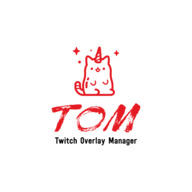

# Twitch Overlay Manger

<p align="center">
  
</p>

Display custom overlays when Twitch events are triggered.

TOM can be useful to create your own overlay animations when viewers
subscribe, follow, request a reward, send you bits, etc.


https://user-images.githubusercontent.com/1642119/142749719-6340bd86-e9c1-49ac-be7f-5c3dbd1d68d5.mp4


## Setup

### Download the App

1. Download the latest release [from this repository](https://github.com/reneolivo/twitch-overlay-manager/archive/refs/heads/master.zip).
2. Extract the contents to a folder.

### Register your App
We need to register our App on Twitch Developer Console in order to get permission to listen to
channel events.

1. Using your favorite editor create a new `.env` file inside the previously extracted folder. The contents of this file should be as follows:
```
TWITCH_CALLBACK_URL=https://localhost:3000/auth/twitch/callback
TWITCH_CLIENT=as_given_by_twitch_dev_console
TWITCH_SECRET=as_given_by_twitch_dev_console
SESSION_SECRET=a_random_text_of_your_preference
```
2. To fill the details for the callback URL, twitch client, and twitch secret please visit [Twitch Developer Console](https://dev.twitch.tv/console/apps/).
3. Register a new APP by clicking on [Register Your Application](https://dev.twitch.tv/console/apps/create).
4. Add any name, for the URL use "https://localhost:3000/auth/twitch/callback", and add any category.
5. Click on the "Manage" button for the newly created app.
6. Copy the Client ID and paste it to the corresponding field in the `.env` file.
7. Click on "New Secret", confirm it, and copy the secret to the corresponding field in the `.env` file.

Once these steps are done you don't need to follow them again to start the app.

### Running the app
1. Download and install [Docker](https://www.docker.com/products/docker-desktop) if it's not already installed. This step only needs to be done once.
2. Open your preferred terminal app and navigate to the previously extracted folder.
  2.1. [Using Command Prompt on Windows](https://www.howtogeek.com/659411/how-to-change-directories-in-command-prompt-on-windows-10/).
  2.2. [Using the Terminal on MacOS](https://www.macworld.com/article/221277/command-line-navigating-files-folders-mac-terminal.html).
  2.3. For Linux based OS follow similar steps as MacOS.
3. run the following command:
```
docker-compose up -d
```
Now your app is up and running. You can stop it by running `docker-compose stop` or using the Docker desktop app. The Docker desktop app will also display some logs related to the app.

Any time you want to start your app again the only command needed is `docker-compose up -d`.

## Using the app

### Authenticating

We need to authenticate on Twitch so the app can listen to the authenticated channel's events.
To do so navigate to [https://localhost:3000](https://localhost:3000) after starting the app. You are going to get a "Deceptive Site Ahead Warning" from your browser since we are using [self signed certificates](https://www.keyfactor.com/blog/self-signed-certificate-risks/). There is no concern since we don't capture any credentials on this APP. All authentication is done on twitch.tv. You can click on "details" then "proceed". Click the "login" link and you'll be redirected to twitch.tv. After authenticating you'll be back to your app, but there won't be any message displayed. You won't need to authenticate again.

### Configuring your overlays

The Twitch Overlay Manager comes with 2 default overlays:

* **Ask Chad Bot for a joke**: Displays and tells a joke out loud using your computer speech syntethizer. Triggers when viewers request this reward.
* **Honor the dead**: Displays messages to pay respect when a character dies during the stream. Multiple users can trigger it at the same time using rewards.

To configure these rewards you need to go to your [Stream Manager's Viewers Reward configuration](dashboard.twitch.tv/viewer-rewards/channel-points/rewards) and add new rewards that have the exact name as the overlays above. If you don't like these names you can edit the overlay's configuration files:

* **Ask Chad Bot for a joke**: `public/overlays/ask-chad-bot-for-a-joke/overlay.json`
* **Honor the dead**: `public/overlays/honor-the-dead/overlay.json`

Just change the `name` field to anything you want. Just make sure to use the same name as the reward on your manager.

### Testing the rewards

1. Navigate to [http://raspberrypi:4000/overlays](http://raspberrypi:4000/overlays).
2. Go to your own stream chat (even if its offline).
3. Click on the reward.

The animation for the corresponding reward should play.

### Configuring your streaming app to show the overlays

Twitch Studio, Stream Labs, and OBS all support adding web pages as overlays. We'll use Twitch Studio as an example, but it should be a similar process for all other streaming apps.

1. Click on the scene you use for streaming.
2. Click on the "edit" button that is now visible.
3. Add a new layer. Choose "Browser Source".
4. Make the overlay as big as the screen.
5. Add "http://raspberrypi:4000/overlays" to the "webpage" field.
6. Enable sounds.
7. Enable "reload when visible". This will help prevent multiple scenes trigger at the same time.

And you are ready!

## Creating your own overlays

1. Create a new folder at `public/overlays`.
2. Create a `main.js` file inside of this new folder. Add a class that implements a static "run" function:
```js
class MyNewOverlay {
  static run(data) {
    // do your magic here
    // You can use also jQuery as its included by default.
  }
}
```
The contents of `data` are:
```js
{
  defaultImage: string, // The reward's image.
  id: number, // The viewer reward's ID. Can be used to reject the reward... in theory.
  message: string, // If the reward accepts a note from the viewer, it will be provided here.
  redemptionDate: Date, // When was this requested. Probably micro seconds ago.
  rewardCost: number, // How many channel points were spent when requesting the reward
  rewardId: number, // The reward type ID.
  rewardImage: Array, // The different image sizes for the reward.
  rewardTitle: string, // The reward title. We use this to match it to an overlay.
  status: string, // Whether the reward has been accepted or rejected.
  userDisplayName: string, // The viewer's display name.
  userId: number, // The viewer's ID.
  userName: string, // The viewers machine name.
}
```
3. Create a new `overlay.json` file inside of the previously created folder. Add these details:
```json
{
  "handler": "MyNewOverlay",
  "name": "My Rewards Name",
  "type": "reward"
}
```
* **handler**: The name of the Javascript class.
* **name**: The name of the reward as defined in the Stream Manager.
* **type**: Is always going to be `reward`, for now.
4. Optionally, you may add a `style.css` file to the overlay folder. Include any CSS used for the overlay. Beware that this is going to modify the global styles so be sure to use unique class names and don't reference generic elements selectors such as `a`, `p`, `h1`, etc. unless they are prefixed with a unique class or ID.

## Todo list

* Make this an Electron APP. This will simplify the setup process as we won't have to install Docker. We'll also be able to configure some of the overlay settings using the App instead of editing JSON or ENV files.
* Add support for more event types such as "follows", "subscriptions", "bits", etc.
* Trigger custom events using a virtual deck.
* Allow events to be triggered using keyboard shortcuts.
* Add support for overlay configuration through the app.
* Add a common class full of helpers.
